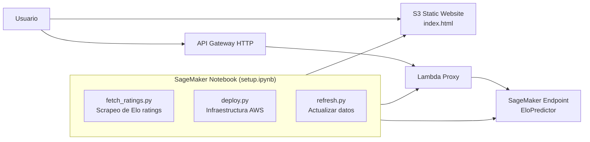

# World Cup Elo Predictor

Predice resultados de partidos de la Copa del Mundo usando **World Football Elo Ratings**. Desplegado completamente en AWS desde un notebook de SageMaker.

## Arquitectura



**Flujo:**
1. `fetch_ratings.py` scrapea ratings desde international-football.net
2. `deploy.py` crea S3, IAM, Lambda, API Gateway y el endpoint SageMaker
3. El usuario visita la UI estática en S3, selecciona dos selecciones y la UI consulta el endpoint vía API Gateway → Lambda → SageMaker
4. `refresh.py` actualiza ratings y regenera el modelo sin redeploy completo

## Estructura

```
worldcup-elo/
├── lambda/
│   └── handler.py          # Proxy Lambda: API Gateway → SageMaker
├── model/
│   ├── elo_model.py        # Lógica de predicción Elo
│   ├── inference.py        # Handlers de SageMaker Inference
│   └── requirements.txt
├── scripts/
│   ├── deploy.py           # Despliegue completo de infraestructura
│   ├── fetch_ratings.py    # Scrapeo de ratings actualizados
│   └── refresh.py          # Refresco de datos sin redeploy
├── ui/
│   └── index.html          # UI estática con selectores y barras
├── ratings.json            # Elo ratings actuales (59 selecciones)
├── setup.ipynb             # Orquestador desde SageMaker Notebook
└── .gitignore
```

## Prerrequisitos

- Cuenta AWS con permisos para SageMaker, S3, IAM, Lambda, API Gateway
- SageMaker Notebook (o entorno con boto3)

## Despliegue

Abrir `setup.ipynb` en SageMaker Notebook y ejecutar las celdas en orden:

| Paso | Acción | Tiempo |
|------|--------|--------|
| 1 | Instalar dependencias (`requests`, `beautifulsoup4`, `numpy`) | ~30s |
| 2 | Ejecutar `fetch_ratings.py` para obtener ratings | ~5s |
| 3 | Ejecutar `deploy.py` — crea S3, IAM, Lambda, API GW, endpoint SageMaker | ~8 min |
| 4 | Probar el endpoint con equipos de ejemplo | ~2s |
| 5 | Abrir la URL de la UI impresa al final del paso 3 | — |

## Refrescar datos

Cuando quieras actualizar los ratings y el modelo sin redeployar todo:

```python
%run scripts/refresh.py
```

Esto scrapea nuevos ratings, regenera `model.tar.gz`, lo sube a S3 y actualiza el endpoint SageMaker.

## Limpiar

Para eliminar todos los recursos al finalizar:

```python
sagemaker.delete_endpoint(EndpointName='worldcup-elo-endpoint')
state = json.loads(open('.deploy_state.json').read())
s3 = boto3.client('s3')
objects = s3.list_objects_v2(Bucket=state['bucket'])
if 'Contents' in objects:
    s3.delete_objects(Bucket=state['bucket'], Delete={'Objects': [{'Key': o['Key']} for o in objects['Contents']]})
s3.delete_bucket(Bucket=state['bucket'])
```

## Tecnologías

- **Python** + **boto3** (AWS SDK)
- **SageMaker** (endpoint PyTorch 2.1 CPU)
- **Lambda** + **API Gateway HTTP** (proxy serverless)
- **S3 Static Website** (frontend)
- **BeautifulSoup** / **requests** (scraping Elo ratings)
